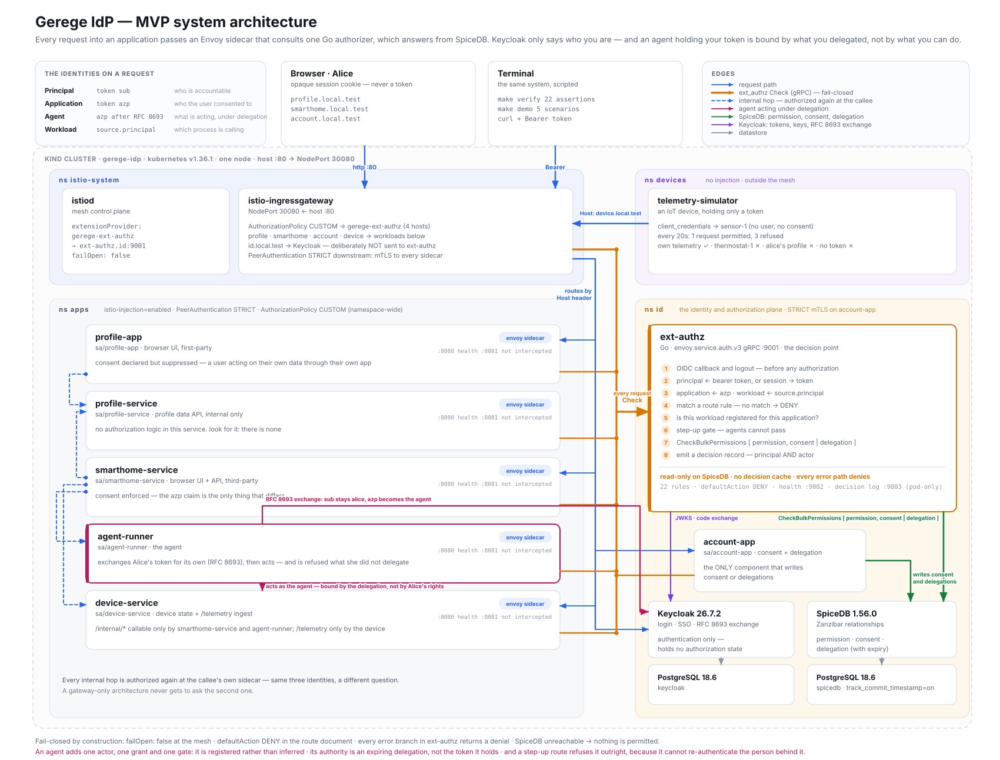

# Gerege IdP — MVP

A working implementation of [`mvp_docs/`](../mvp_docs/README.md): authentication, single
sign-on, relationship-based authorization, consent, and an Istio/Envoy sidecar routing
**every** request — external and internal — through a Go external authorizer backed by
SpiceDB.

Extended beyond that scope with **agent identity**: a delegated actor that holds a user's
token and is still bound by what the user delegated, for as long as the delegation lasts
([docs/agent-identity.md](docs/agent-identity.md)).

Runs on one machine, on Kubernetes. Everything is drivable from a terminal; the
demonstration applications are also usable in a browser.

```bash
sudo make hosts     # once — five hostnames pointing at loopback
make up             # kind cluster, Istio, Keycloak, SpiceDB, seven services
make verify         # 29 assertions, unattended
make demo           # the five scenarios, one keypress at a time
```

---

## Architecture



Everything in that picture is taken from the manifests and code in this directory —
namespaces, ServiceAccounts, ports, the extension provider, and the arrows that exist at
runtime. The amber edges are the ones the design is about: the ingress gateway and every
application sidecar call one Go authorizer before a request reaches any service, and that
authorizer answers from SpiceDB. Keycloak is not on that path.

---

## What is running

| | | |
|---|---|---|
| **Keycloak 26.7.2** | `id` | Users, login, SSO session. **Authentication only** |
| **SpiceDB 1.56.0** | `id` | Every permission and every consent decision |
| **PostgreSQL 18.6** ×2 | `id` | Separate stores for Keycloak and SpiceDB |
| **ext-authz** | `id` | Go, gRPC. The only custom infrastructure component |
| **account-app** | `id` | Consent console — the one component that writes consent |
| **Istio 1.30.3** | `istio-system` | Sidecars, mTLS, `ext_authz` on every request |
| **profile-app** | `apps` | Browser-facing, first-party |
| **profile-service** | `apps` | Profile data API. Never reachable from outside |
| **smarthome-service** | `apps` | Third-party app. Calls device-service and profile-service |
| **device-service** | `apps` | Device state and telemetry ingest |
| **agent-runner** | `apps` | The agent. Exchanges a user's token for one of its own |
| **telemetry-simulator** | `devices` | An IoT device, outside the mesh, with its own identity |

Kubernetes runs in [kind](https://kind.sigs.k8s.io/) 0.32.0 on node image v1.36.1.
Every version is the current stable release.

---

## Prerequisites

Docker (or OrbStack) with at least 4 CPUs and 6 GiB, plus:

```bash
make prereqs        # brew install kind istioctl authzed/tap/zed
```

`kubectl` and a Go toolchain are also needed. `zed` earns its place: `zed permission
check <resource> <permission> <subject> --explain` turns "why was this denied" into a
two-second query, and it is the first thing to reach for when a demo misbehaves.

---

## The five things worth seeing

If a reviewer has ten minutes, run `make demo S="2 3b 5"`.

### Authorization is data, not deployed code

Bob is refused Alice's profile. One relationship is written to SpiceDB. Bob is
permitted — with the same unchanged token, no redeploy, no restart, no reload. Delete
the relationship; refused again.

```
$ GET /profile/alice      as bob
 DENIED     HTTP 403  reason=permission_denied

$ zed relationship create gerege/user_profile:alice reader gerege/user:bob

$ GET /profile/alice      as bob — the same token as before
 PERMITTED  HTTP 200
```

### Consent gates a third-party application

The profile app reads Alice's record with no prompt. The smart-home app is refused the
same record, with reason `consent_required` and a challenge pointing at the consent
screen. After Alice approves, the identical request — same token — succeeds. She
revokes; the next request is refused.

Same user, same data, same permission. The variable is the `azp` claim: the application
she would be consenting to.

### The internal hop is independently authorized

Alice unlocks `lock-1` through the smart-home app. Three authorization decisions are
made for that one click, at three enforcement points:

```
ENFORCER               METHOD  RESOURCE                PERMISSION     VERDICT
ingress-gateway        POST    gerege/home:alice-home  view           ALLOW
apps/smarthome-service POST    gerege/home:alice-home  view           ALLOW
apps/device-service    POST    gerege/device:lock-1    operate_lock   ALLOW
```

Downgrade Alice from `owner` to `guest` of her own home. She can still *see* the
home, so the first two decisions still permit — but `operate_lock` derives from
`administrate`, so device-service refuses. **The external call succeeds and the internal
one does not.** A gateway-only architecture would have opened the door.

### Token replay is contained

Alice's valid, unexpired access token, replayed straight at device-service, is refused
with `workload_not_registered`. Nothing about the token is wrong. It is refused because
the calling workload is not registered to serve that application, and the mesh proves
workload identity with mTLS rather than taking the caller's word for it.

### An agent does not inherit the user it acts for

The assistant holds Alice's access token — `sub` is genuinely hers — and Alice has already
granted the smart-home application full consent. It is still refused everything:

```
acting for alice  as  assistant-agent   (token exchanged: true)
REFUSED    read profile     profile_read     delegation_required
REFUSED    set thermostat   devices_control  delegation_required
REFUSED    unlock lock-1    devices_unlock   step_up_required
```

Alice delegates two capabilities for five minutes; exactly those two start working, and
lapse on their own. The door never opens for the agent at all — `devices_unlock` requires
a person who authenticated deliberately, and an agent cannot re-authenticate the human
behind it. Alice unlocks it herself in the same breath, on the same lock, with the same
permission.

The decision log is where this becomes accountable rather than merely enforced:

```
ENFORCER               RESOURCE                    PRINCIPAL  ACTOR      REASON
apps/agent-runner      gerege/home:alice-home      alice      —          permitted
apps/profile-service   gerege/user_profile:alice   alice      assistant  permitted
apps/device-service    rule:device-unlock          alice      assistant  step_up_required
apps/device-service    gerege/device:lock-1        alice      —          permitted
```

Alice stays the principal throughout, because she stays accountable. The `actor` column
separates what she did from what was done on her behalf.

### It fails closed

Stop SpiceDB: six consecutive requests, none permitted, all with reason
`backend_unavailable`. Call an endpoint with no rule: `no_route_match`. Stop ext-authz
entirely: Envoy denies, because `failOpen` is off.

---

## Using it from a browser

| | |
|---|---|
| http://profile.local.test | Profile app — sign in as `alice` / `alice` |
| http://smarthome.local.test | Smart home — opens with no second login |
| http://account.local.test | Consent console — grant, revoke, and delegate to the agent |
| http://id.local.test | Keycloak — `admin` / `admin` |

Five separate hostnames, not five paths on one host, because single sign-on across
*different origins* is the claim. Two applications on one hostname would share a cookie
and demonstrate nothing about the identity layer.

The SSO walkthrough: open the profile app in a fresh window, log in, then open the
smart-home app. It renders immediately. Watch the network panel — the redirect chain
through Keycloak is what distinguishes genuine identity-provider SSO from a shared
cookie, which would look identical here while proving nothing.

---

## From the terminal

```bash
make inspect             # look inside SpiceDB: schema, facts, who is authorized for what
make verify              # 22 assertions across all eight claims
make demo                # all scenarios;  make demo S="2 3b 5"  for the short set
make demo S=6            # the agent
make decisions           # the authorization decision log, one line per decision
./scripts/decisions.sh -f  # follow it live
make sensor              # the IoT device: one request allowed, three refused, each cycle
make shell-zed           # port-forward SpiceDB and print zed recipes
make reseed              # reset the demo world in seconds
make test                # offline: schema assertions, route config, Go tests
```

### Looking inside SpiceDB

`make inspect` prints the model, every relationship, and a computed matrix of who may do
what — then `A="why ..."` answers the only question that matters during an incident:

```bash
make inspect A="why gerege/device:lock-1 operate_lock gerege/user:bob"
make inspect A="who gerege/user_profile:alice view"
make inspect A="what gerege/device operate gerege/user:alice"
make inspect A="watch"
make inspect A="shell"
```

The matrix is *computed* on every run, not stored. Add one relationship and a row moves —
which is Scenario 2 seen from the database side rather than through HTTP.

`make test` needs no cluster. It runs the SpiceDB schema assertion suite, validates the
route configuration, and runs the Go tests — including the fail-closed table, which is
the executable form of claim C8 and the test that must pass before any other.

---

## Layout

```
mvp/
├── spicedb/
│   ├── schema.zed              the permission model — every decision resolves here
│   ├── validation.yaml         50 assertions; negative ones matter more than positive
│   └── seed.yaml               the demo world. No consent is seeded, deliberately
├── keycloak/realm-gerege.json  users, clients, no authorization state
├── services/
│   ├── config/ext-authz.yaml   the authorization map: path → resource, permission, capability
│   ├── cmd/agent-runner/       the agent: RFC 8693 exchange, then act
│   ├── internal/decision/      the pipeline, and failclosed_test.go
│   ├── internal/routes/        specificity-ordered matching; ambiguity is a startup error
│   ├── internal/spicedb/       Checker (read-only, used by ext-authz) and Writer (consent, delegation)
│   └── cmd/                    eight programs, one image
├── istio/istio.yaml            extension provider, failOpen: false
├── deploy/                     numbered manifests, applied in bootstrap order
└── scripts/                    bootstrap, verify, demo, seed, reseed, decisions
```

---

## How a request is decided

```
Request → Envoy sidecar → ext-authz (gRPC)
   ├─ 1. OIDC callback / logout?          handled before authorization
   ├─ 2. principal    bearer token, or session cookie → access token
   ├─ 3. application  token `azp`         │  workload  source.principal (mTLS)
   ├─ 4. match a route rule               no match → DENY
   ├─ 5. is this workload registered?     not registered → DENY
   ├─ 6. step-up gate                     sensitive capability → a human must be present
   ├─ 7. CheckBulkPermissions [permission, consent? delegation?]
   └─ 8. emit a decision record
```

Keycloak is not on this path. SpiceDB is the only authorization backend. Every failure
mode denies — there is no path where a dependency being unreachable results in a permit.

The three identities, and what each answers:

| | From | Answers |
|---|---|---|
| **Principal** | Session or bearer token `sub` | Whose data, and who is accountable |
| **Application** | Token `azp` | Who the user consented to |
| **Agent** | Token `azp`, after an RFC 8693 exchange | What is acting, and under what delegation |
| **Workload** | `source.principal` from mTLS | Which process is calling |

Permission is checked against the principal. Consent is checked against the
**application**; delegation is checked against the **agent**. The workload must be
registered to serve that route. Any of them can deny.

---

## Implementation notes

Where the build had to decide something the design documents left open, or where reality
disagreed with them, it is recorded in
[docs/implementation-notes.md](docs/implementation-notes.md). The short version:

- SpiceDB object IDs cannot contain `.` or `~`, so capabilities are `profile_read` and
  consent grants are `alice|smarthome-app`.
- A consent console was added. ext-authz must stay read-only on SpiceDB, so consent has
  to be written by something else.
- Two rule kinds beyond the documented one — `public` and `authenticatedOnly` — so that
  a static asset and a dashboard shell can be declared rather than exempted.
- Assertion A10 is demonstrated by downgrading Alice from owner to guest rather than by
  switching to Bob, because Bob is refused at the first hop and the assertion is about
  the *internal* one.
- Keycloak's standard token exchange emits no `act` claim, so the actor is reconstructed
  from `azp` — sufficient for one hop, and the reason the MVP has exactly one agent.
- Delegation replaces consent for agents rather than adding to it; each actor kind gets
  one binding grant.

---

## What this is not

Development secrets, single replicas, self-signed nothing, plain HTTP. The threat model
in [`docs/06`](../docs/06-security-and-operations.md) does not apply to this environment
and this is not a performance demonstration — there is no caching, by design (M-005), so
that revocation is immediate and every demo step reflects SpiceDB state exactly.

Two deliberate divergences from the production architecture, both trading production
characteristics for demonstrability, both worth stating aloud to anyone who has read
[`docs/`](../docs/README.md):

| | MVP | Production |
|---|---|---|
| M-002 | ext-authz holds sessions and drives OIDC | Stateless JWT validation at Envoy |
| M-005 | No decision caching | ~70% cache hit rate required |
